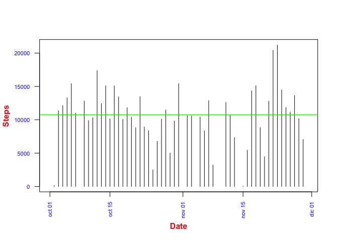
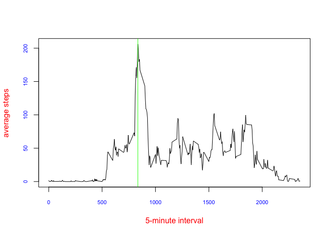
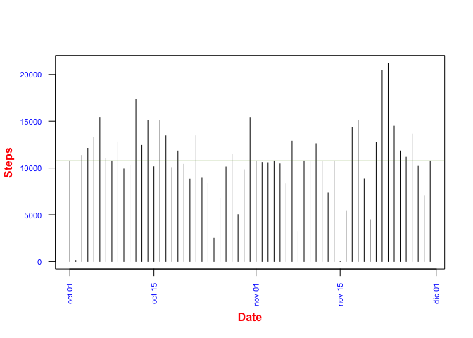
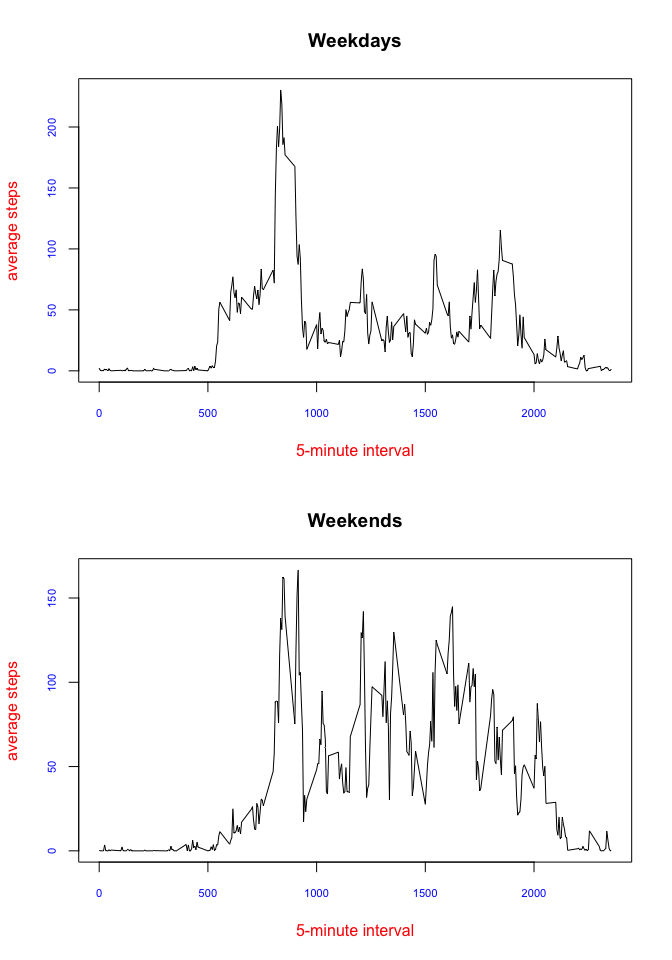

# Activity data
Eduardo Suja  
12 de octubre de 2016  

### Setting global options

```r
knitr::opts_chunk$set(echo = TRUE)
```

### Loading data.
No preprocess is needed.

```r
activity <- read.csv("activity.csv", header=TRUE)
```

### Mean total number of steps taken per day

```r
steps_per_day <- aggregate(activity$steps, by=activity["date"], FUN=sum)
library(lubridate)
```

```
## 
## Attaching package: 'lubridate'
```

```
## The following object is masked from 'package:base':
## 
##     date
```

```r
steps_per_day$mydate <- ymd(steps_per_day$date)
plot(
      steps_per_day$mydate, steps_per_day$x, type = "h", 
      xlab = "Date", ylab = "Steps", font.lab = 2, col.lab = "red",
      las = 2, cex.axis = 0.7, col.axis = "blue"
     )

mymean <- mean(steps_per_day$x, na.rm = TRUE)
abline(h=mymean, col="brown")
mymedian <- median(steps_per_day$x, na.rm = TRUE)
abline(h=mymedian, col="green")
```

<!-- -->

#### Mean total number taken per day

```r
mymean
```

```
## [1] 10766.19
```

#### Median total number taken per day

```r
mymedian
```

```
## [1] 10765
```

### Average daily activity pattern

```r
activity_rm_na <- activity[! is.na(activity$steps),]
mean_per_interval <- tapply(activity_rm_na$steps, activity_rm_na$interval, mean)
plot(
        names(mean_per_interval), mean_per_interval, type = "l",
        xlab = "5-minute interval", ylab="average steps",
        col.lab="red", col.axis="blue",
        cex.axis=0.7
        )
abline(v=names(which.max(mean_per_interval)), col="green")
```

<!-- -->

#### 5-minute interval containing the maximum average number of steps

```r
names(which.max(mean_per_interval))
```

```
## [1] "835"
```

### Imputing missing values

#### Number of missing values in the dataset

```r
activity_na <- activity[is.na(activity$steps) | is.na(activity$date) | is.na(activity$interval),]
dim(activity_na)[1]
```

```
## [1] 2304
```

#### Filling in missing values with the mean for that 5-minute interval

```r
f_activity <- activity
for (i in 1:nrow(f_activity)){
        if (is.na(f_activity$steps[i])){
        interval <- f_activity$interval[i]
        element <- which(names(mean_per_interval)==interval)
        f_activity$steps[i] = mean_per_interval[element]
        }
}

f_steps_per_day <- aggregate(f_activity$steps, by=f_activity["date"], FUN=sum)
f_steps_per_day$mydate <- ymd(f_steps_per_day$date)
plot(
      f_steps_per_day$mydate, f_steps_per_day$x, type = "h", 
      xlab = "Date", ylab = "Steps", font.lab = 2, col.lab = "red",
      las = 2, cex.axis = 0.7, col.axis = "blue"
     )
f_mymean <- mean(f_steps_per_day$x, na.rm = TRUE)
abline(h=f_mymean, col="brown")
f_mymedian <- median(f_steps_per_day$x, na.rm = TRUE)
abline(h=f_mymedian, col="green")
```

<!-- -->

#### Mean total number taken per day with missing values filled in

```r
f_mymean
```

```
## [1] 10766.19
```

#### Median total number taken per day with missing values filled in

```r
f_mymedian
```

```
## [1] 10766.19
```
The mean has not changed, and the median has slightly changed. The impact of imputing missing data is nearly null. This is not a surprise, as we are calculating the mean and the median, and we have filled missing values with the mean. However, the plot whithout missing values looks better, with no blank columns.
```

### Differences in activity patterns between weekdays and weekends

```r
f_activity$weekday <- weekdays(ymd(f_activity$date))
weekend_days <- c("sábado", "domingo")
for (i in 1:nrow(f_activity)){
        f_activity$day_type[i] <- 
        if (f_activity$weekday[i] %in% weekend_days) {"weekend"}
                                                else {"weekday"}
        }

wd_activity <- f_activity[f_activity$day_type=="weekday",]
we_activity <- f_activity[f_activity$day_type=="weekend",]

wd_mean <- tapply(wd_activity$steps, wd_activity$interval, mean)
we_mean <- tapply(we_activity$steps, we_activity$interval, mean)

par(mfrow=c(2,1))
plot(
        names(wd_mean), wd_mean, type = "l", main="Weekdays",
        xlab = "5-minute interval", ylab="average steps",
        col.lab="red", col.axis="blue",
        cex.axis=0.7
        )

plot(
        names(we_mean), we_mean, type = "l",main="Weekends",
        xlab = "5-minute interval", ylab="average steps",
        col.lab="red", col.axis="blue",
        cex.axis=0.7
        )
```

<!-- -->
